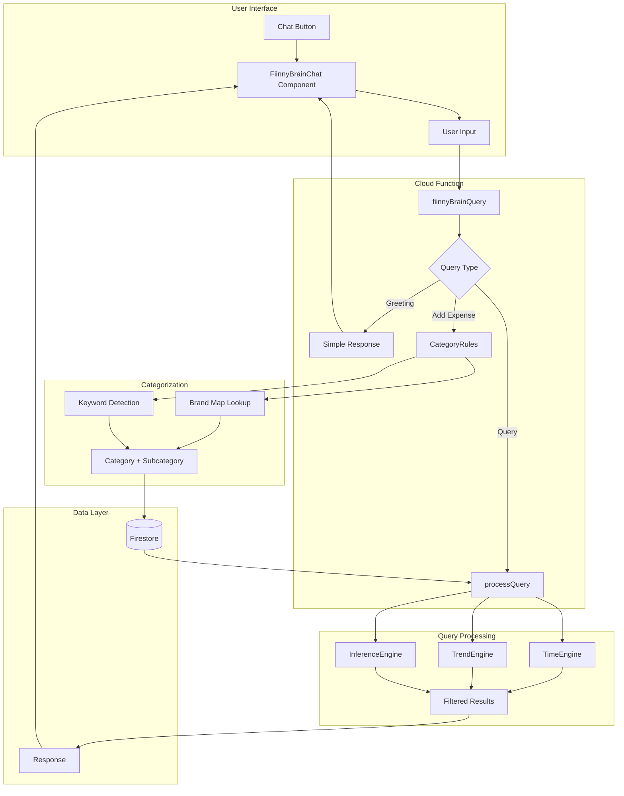
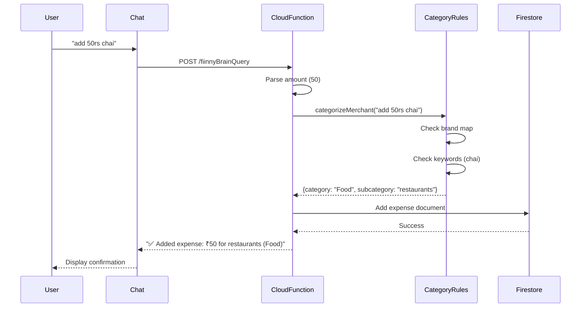
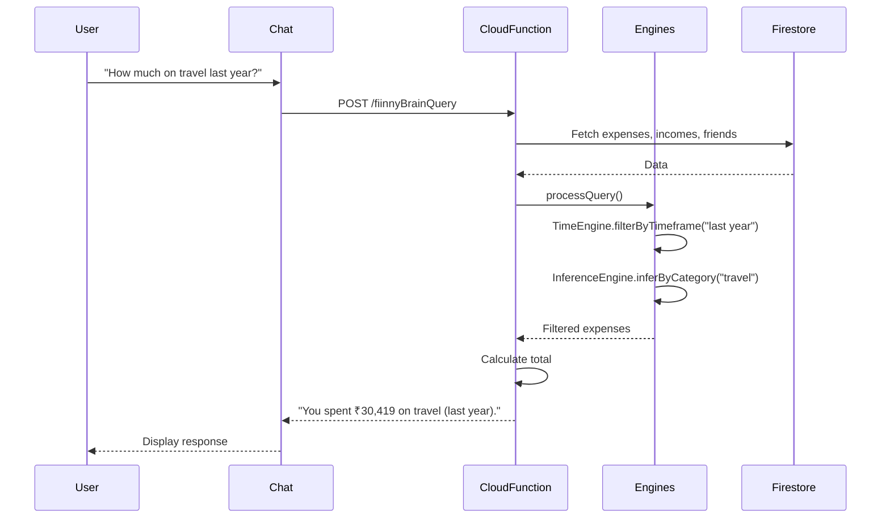

# Fiinny AI & Intelligence

Fiinny's AI-powered features provide intelligent expense tracking, natural language queries, and smart categorization. This section documents all AI components and their data flows.

## Overview

Fiinny Brain is the AI assistant that powers:
- **Natural Language Chat**: Ask questions about your finances in plain English
- **Smart Categorization**: Automatic expense categorization using 100+ brand mappings
- **Expense Creation**: Add expenses via chat with natural language parsing
- **Query Processing**: Complex financial queries with time-based filtering

---

## Architecture



---

## Components

### 1. FiinnyBrainChat Component
**Location**: `website/components/FiinnyBrainChat.tsx`

**Features**:
- 3-state UI (small, half-screen, full-screen)
- Real-time message sync with Firestore
- Suggestion chips for common queries
- Smooth animations with Framer Motion

**State Management**:
```typescript
const [isOpen, setIsOpen] = useState(false);
const [size, setSize] = useState<"small" | "half" | "full">("small");
const [messages, setMessages] = useState<Message[]>([]);
```

---

### 2. Cloud Function: fiinnyBrainQuery
**Location**: `functions/src/fiinnyBrainQuery.ts`

**Endpoint**: `https://us-central1-lifemap-72b21.cloudfunctions.net/fiinnyBrainQuery`

**Request Format**:
```json
{
  "userPhone": "+919876543210",
  "query": "How much on travel last year?"
}
```

**Response Format**:
```json
{
  "response": "You spent ₹30,419 on travel (last year)."
}
```

---

### 3. CategoryRules Engine
**Location**: `functions/src/categoryRules.ts`

**Purpose**: Smart expense categorization using brand mappings and keyword detection

**Brand Map** (100+ brands):
- **Food**: Zomato, Swiggy, Starbucks, McDonald's, KFC
- **Shopping**: Amazon, Flipkart, Myntra
- **Travel**: Uber, Ola, IRCTC
- **Entertainment**: Netflix, Hotstar, Prime Video
- **Fuel**: HPCL, BPCL, IOCL

**Keyword Detection**:
```typescript
// Food keywords
/\b(chai|coffee|tea|cafe|restaurant|meal|snack)\b/

// Travel keywords
/\b(travel|flight|train|bus|cab|taxi|hotel)\b/

// Groceries keywords
/\b(grocery|kirana|mart|fresh|vegetables)\b/
```

**Output**:
```typescript
interface CategoryGuess {
    category: string;        // "Food"
    subcategory: string;     // "restaurants"
    confidence: number;      // 0.75
    tags: string[];          // ["food"]
}
```

---

## Data Flow Diagrams

### Expense Creation Flow



### Query Processing Flow



### Categorization Logic Flow

```mermaid
flowchart TD
    A[Input: "add 50rs chai"] --> B{Brand Map Match?}
    B -->|Yes| C[Return brand category]
    B -->|No| D{Keyword Match?}
    D -->|Food keywords| E[Category: Food<br/>Subcategory: restaurants]
    D -->|Travel keywords| F[Category: Travel<br/>Subcategory: travel others]
    D -->|Shopping keywords| G[Category: Shopping<br/>Subcategory: ecommerce]
    D -->|No match| H[Category: Others<br/>Subcategory: others]
    
    E --> I[Add to Firestore]
    F --> I
    G --> I
    H --> I
```

---

## Processing Engines

### TimeEngine
**Purpose**: Filter expenses by time periods and day types

**Methods**:
- `filterByDayType(expenses, isWeekend)` - Weekend vs weekday filtering
- `filterByTimeOfDay(expenses, period)` - Morning/afternoon/evening/night

**Example**:
```typescript
// Query: "How much on weekends?"
const weekendExpenses = TimeEngine.filterByDayType(expenses, true);
const total = weekendExpenses.reduce((sum, e) => sum + e.amount, 0);
// Response: "You spent ₹5,000 on weekends (all time)."
```

### TrendEngine
**Purpose**: Analyze spending trends and detect anomalies

**Methods**:
- `calculateGrowthRate(current, previous)` - Month-over-month growth
- `analyzeTrendDirection(growth)` - Increasing/decreasing/stable
- `detectAnomaly(current, history)` - Spending spikes

**Example**:
```typescript
// Query: "Is my spending increasing?"
const thisMonth = expenses.filter(/* this month */);
const lastMonth = expenses.filter(/* last month */);
const growth = TrendEngine.calculateGrowthRate(thisMonth, lastMonth);
// Response: "Your spending is slightly increasing (5.2% vs last month)."
```

### InferenceEngine
**Purpose**: Infer categories and contexts from queries

**Methods**:
- `inferByCategory(expenses, category)` - Filter by category keywords
- `inferContext(expenses, context)` - Filter by context (office, vacation)
- `inferComplexIntent(expenses, intent)` - Complex queries (hospital travel)

**Example**:
```typescript
// Query: "Show food expenses"
const foodExpenses = InferenceEngine.inferByCategory(expenses, "food");
// Response: "You spent ₹12,450 on food (all time)."
```

---

## Supported Query Types

### 1. Greetings
- "Hi", "Hello", "Hey"
- Response: Welcome message with capabilities

### 2. Expense Creation
- "add expense of 500rs"
- "add 50 for chai"
- "spent 1000 on travel"
- "paid 250rs for grocery"

### 3. Time-based Queries
- "How much this month?"
- "Travel expenses last year"
- "Show spending this year"

### 4. Category Queries
- "How much on food?"
- "Show travel expenses"
- "Medical spending"

### 5. Time-of-Day Queries
- "How much on weekends?"
- "Spending in the morning"
- "Evening expenses"

### 6. Trend Analysis
- "Is my spending increasing?"
- "Show spending trends"
- "Detect spending spikes"

### 7. Split Queries
- "Who owes me money?"
- "How much does Karan owe me?"
- "Show split expenses"

---

## Firestore Schema

### Messages Collection
**Path**: `users/{userPhone}/fiinny_brain_messages/{messageId}`

```typescript
interface Message {
    id: string;
    text: string;
    sender: "user" | "bot";
    timestamp: Timestamp;
    status: "sent" | "delivered" | "error";
}
```

### Expenses Collection
**Path**: `users/{userPhone}/expenses/{expenseId}`

```typescript
interface Expense {
    amount: number;
    category: string;
    subcategory: string;
    description: string;
    date: Date;
    labels: string[];
    payerId: string;
    createdAt: Date;
    updatedAt: Date;
}
```

---

## Performance & Scalability

### Cloud Function Limits
- **Free Tier**: 2M invocations/month (~66,666 queries/day)
- **Timeout**: 60 seconds
- **Memory**: 256 MB
- **Region**: us-central1

### Optimization Strategies
1. **Early Returns**: Greetings handled before DB calls
2. **Parallel Fetching**: Expenses, incomes, friends fetched concurrently
3. **Indexed Queries**: Firestore queries use composite indexes
4. **Caching**: Message history cached in component state

---

## Error Handling

### Client-Side
```typescript
try {
    const response = await fetch(CLOUD_FUNCTION_URL, {
        method: "POST",
        headers: { "Content-Type": "application/json" },
        body: JSON.stringify({ userPhone, query }),
    });
    const data = await response.json();
    // Handle response
} catch (error) {
    // Show error message to user
}
```

### Server-Side
```typescript
try {
    // Process query
} catch (error: any) {
    console.error("Error processing query:", error);
    res.json({ 
        response: `Sorry, I encountered an error: ${error.message}` 
    });
}
```

---

## Future Enhancements

### Planned Features
1. **Voice Input**: Speech-to-text for hands-free queries
2. **Multi-language**: Support for Hindi, Tamil, Telugu
3. **Predictive Insights**: "You usually spend ₹5000 on groceries"
4. **Budget Alerts**: "You've exceeded your food budget"
5. **Receipt OCR**: Extract expenses from receipt images
6. **Recurring Detection**: Auto-detect subscriptions and EMIs

### AI Model Integration
- **GPT-4**: For complex natural language understanding
- **Custom Models**: Fine-tuned on Indian financial data
- **Embeddings**: Semantic search for similar expenses

---

## Testing

### Manual Testing
```bash
# Test greeting
curl -X POST https://us-central1-lifemap-72b21.cloudfunctions.net/fiinnyBrainQuery \
  -H "Content-Type: application/json" \
  -d '{"userPhone": "+919876543210", "query": "Hi"}'

# Test expense creation
curl -X POST https://us-central1-lifemap-72b21.cloudfunctions.net/fiinnyBrainQuery \
  -H "Content-Type: application/json" \
  -d '{"userPhone": "+919876543210", "query": "add 50rs chai"}'

# Test query
curl -X POST https://us-central1-lifemap-72b21.cloudfunctions.net/fiinnyBrainQuery \
  -H "Content-Type: application/json" \
  -d '{"userPhone": "+919876543210", "query": "How much on travel last year?"}'
```

### Unit Tests
```typescript
describe('CategoryRules', () => {
    it('should categorize chai as food', () => {
        const result = CategoryRules.categorizeMerchant('add 50rs chai');
        expect(result.category).toBe('Food');
        expect(result.subcategory).toBe('restaurants');
    });
});
```

---

## Monitoring & Analytics

### Firebase Console
- Function invocations count
- Error rate
- Average execution time
- Memory usage

### Custom Metrics
- Queries per user
- Most common query types
- Categorization accuracy
- Response time distribution

---

## Related Documentation
- [CategoryRules Source](https://github.com/yourusername/lifemap/blob/main/functions/src/categoryRules.ts)
- [FiinnyBrainChat Component](https://github.com/yourusername/lifemap/blob/main/website/components/FiinnyBrainChat.tsx)
- [Cloud Function](https://github.com/yourusername/lifemap/blob/main/functions/src/fiinnyBrainQuery.ts)
