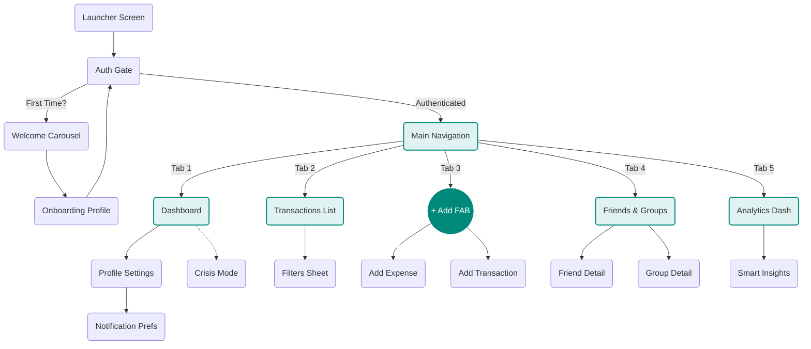

# Welcome to Fiinny Wiki

**The Single Source of Truth for Fiinny Engineering.**

This internal portal hosts documentation for the **Fiinny Mobile App** (Flutter), **Marketing Website** (Next.js), and **Backend Services** (Firebase).

## Quick Links

- [App Architecture](/mobile-app/architecture)
- [Core Codebase](/mobile-app/core)
- [Deployment Guides](/deployment)

> **For New Joiners:** Start by reading the [Core Codebase](/mobile-app/core) section to understand `main.dart` and the app entry point.

## App Flow

Visual map of the application screens. Click on nodes to jump to their documentation.

