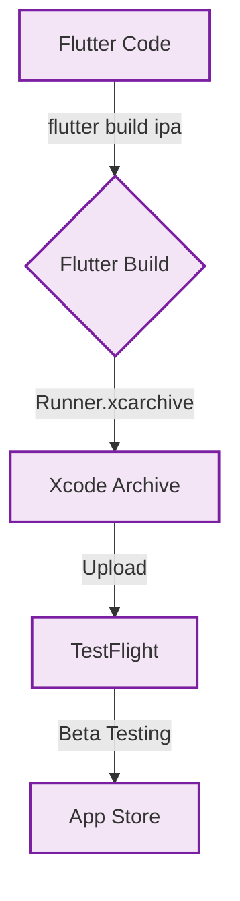

# iOS Configuration

Specifics for the iOS build of the Flutter app.

## Overview

While the core logic is shared, the iOS layer requires specific configuration for permissions, UI guidelines, and capabilities.

## Vital Files

- **`ios/Runner/Info.plist`**: The manifest for permissions and app settings.
- **`ios/Podfile`**: CocoaPods dependency manager.

## Release Workflow



## Permissions

Fiinny requests strict permissions on iOS to ensure transparency.

| Key | Usage Description |
| :--- | :--- |
| `NSPhotoLibraryUsageDescription` | Required for attaching receipts to expenses. |
| `NSCameraUsageDescription` | Required for scanning physical receipts. |
| `NSFaceIDUsageDescription` | Used for local App Lock authentication. |

> **Note**: SMS permission is **not** available on iOS. The iOS app relies on Manual Entry and Gmail Sync only.

## Build

```bash
flutter build ipa --release
```
