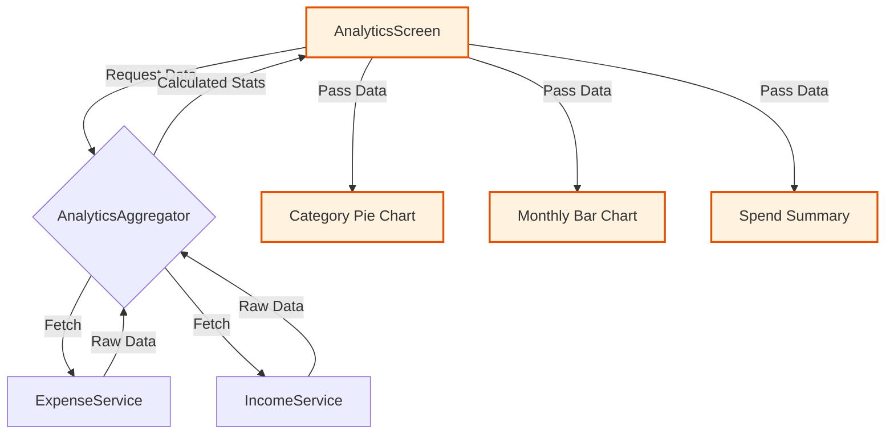

import { PropsTable } from '../../../components/props-table';

# Analytics Screen

The central hub for financial data visualization and analysis.

## Overview

A comprehensive dashboard that aggregates expense and income data to provide actionable insights. It supports multiple time periods (Day, Week, Month, Year, All Time) and deep filtering.

## Features

- **Period Selection**: Custom "Soft Pill" selector for quick time-range switching (`D`, `W`, `M`, `Y`, `All`).
- **Scope Toggle**: Switch between `All`, `Savings`, and `Credit Cards` to isolate spending sources.
- **Category Insights**: 
    - **Drilldown**: Tapping a category opens a detailed breakdwon of top merchants and subcategories.
    - **Heatmap**: Visualizes high-frequency spending areas.
- **Trend Analysis**: "Last X Months" trend card to compare current spending vs historical averages.
- **Smart Filtering**: Integrates with `ExpenseFiltersScreen` for advanced querying (by Merchant, Bank, Friend, etc.).

## Architecture

**Data Aggregation Pipeline:**

- **Aggregators**: Uses `AnalyticsAgg` and local caching (`_aggCache`, `_memo`) to perform heavy number crunching on the client side without UI lag.
- **Charts**: deeply integrates `fl_chart` for rendering Bar and Pie charts directly within the scroll view.
- **Data Source**: Fetches raw `ExpenseItem` and `IncomeItem` lists and processes them locally.

## Props

<PropsTable props={[
  {
    name: 'userPhone',
    type: 'String',
    required: true,
    description: 'User ID context used for data fetching and personalization.'
  }
]} />
