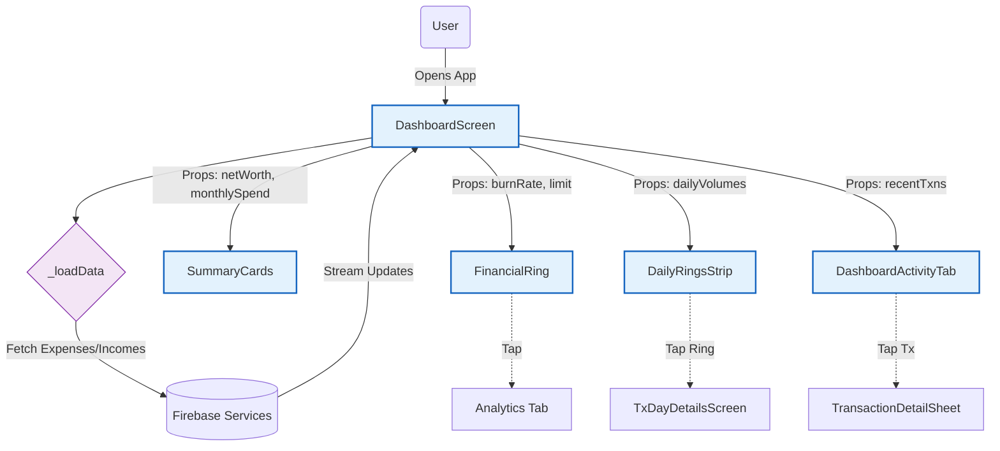

import { PropsTable } from '../../../components/props-table';

# Dashboard Screen

The central data hub and landing interface.

## Overview

`DashboardScreen` is the most complex screen in the application. It aggregates data from virtually every service to provide a holistic financial snapshot. It handles synchronization, background initialization, and the display of key financial metrics (Net Worth, Goals, Loans, Spending).

## Primary Responsibilities

1.  **Data Orchestration**: Fetches and combines specific streams:

    - `ExpenseService` & `IncomeService` for transactions.
    - `GoalService` for financial targets.
    - `LoanService` & `AssetService` for net worth.
    - `SubscriptionService` for recurring payments.
2.  **Visualization**:
    - **Hero Ring**: Animated credit/debit summary (using `HeroTransactionRing`).
    - **Net Worth**: Glass panel calculation (`NetWorthPanel`).
    - **Insight Feed**: AI-driven financial insights (`InsightFeedCard`).
3.  **Synchronization**:
    - **Manual Sync**: Triggers `GmailService` and `SmsIngestor`.
    - **Permissions**: Manages Android SMS permission requests with a compliant disclosure dialog.
4.  **Notifications**: Initializes `SystemRecurringLocalScheduler` and `SocialEventsWatch`.

## Key Logic

- **Animation**: The "Dashboard Numbers" (Credit, Debit, Count) are interpolated using a custom `AnimationController` (`_numbersCtrl`) for a smooth counting effect on refresh.
- **Limit Warnings**: Checks 80% and 100% spending limits against cached period limits and triggers alerts (`_checkLimitWarnings`).
- **Gmail Backfill**: Checks `users/{uid}/gmailBackfillDone` to run a one-time historical fetch for new users.

## Structure

The screen is built as a `CustomScrollView` with a `SliverToBoxAdapter` containing the layout column:
- **Header**: User greeting & sync controls.
- **Main Ring**: `HeroTransactionRing` or `DashboardHeroCard`.
- **Summary Cards**: `TransactionCountCard`, `TransactionAmountCard`.
- **Secondary Data**: `GoalsSummaryCard`, `AssetsSummaryCard`, `LoansSummaryCard`, `SubscriptionsSummaryCard`.
- **Feed**: `InsightFeedCard` (bottom section).

## Dependency Injection

Most services are instantiated directly or accessed via Singletons:
- `FiinnyBrainService`
- `NotificationService`
- `AdService`

## Props

<PropsTable props={[
  {
    name: 'userPhone',
    type: 'String',
    required: true,
    description: 'User identifier for data fetching.'
  }
]} />
