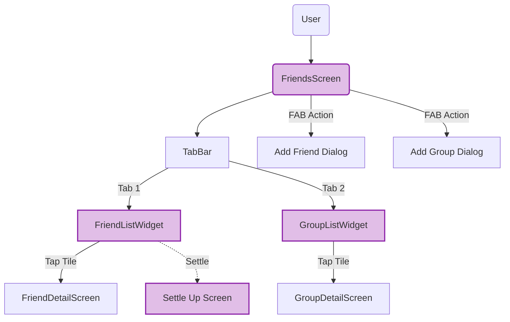

import { PropsTable } from '../../../components/props-table';

# Friends Screen

The main social hub of the application.

## Overview

A comprehensive dashboard for managing relationships and shared finances. It combines a tabbed interface (All/Friends/Groups) with advanced filtering and search capabilities.

## Features

- **Settle Smart**: A prominent animated CTA (`_SettleSmartCTA`) that suggests optimized settlement actions.
- **Filtering**:
    - **Direction**: "Filter by Owed to you" vs "You owe".
    - **Open Only**: Toggles viewing only unsettled balances.
- **Tabs**:
    1.  **All**: Aggregated view.
    2.  **Friends**: Individual relationships.
    3.  **Groups**: Group entities.
    4.  **Activity**: Recent shared expenses.
- **Search Overlay**: An animated expandable search bar.

## Architecture

**Social Graph Navigation:**

- **State**: Manages filters (`_direction`, `_openOnly`) locally.
- **Data**: Streams friends and groups from `FriendService` and `GroupService`.
- **Navigation**: Routes to `FriendDetailScreen` or `GroupDetailScreen`.

## Props

<PropsTable props={[
  {
    name: 'userPhone',
    type: 'String',
    required: true,
    description: 'User ID context.'
  }
]} />
