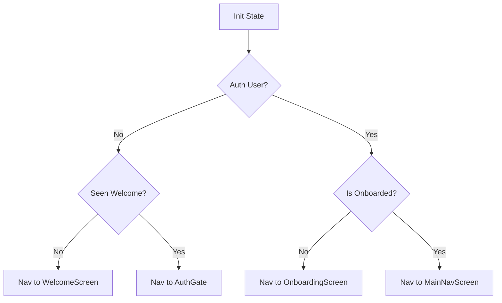

import { PropsTable } from '../../../components/props-table';

# Launcher Screen

The application's initial bootstrap entry point, responsible for state checks and routing.

## Overview

`LauncherScreen` is the very first widget mounted by `MaterialApp` (the `home` route). It acts as a splash screen while performing critical async initialization:
1.  **Auth Check**: Checks `FirebaseAuth.instance.currentUser`.
2.  **Preference Check**: Reads `StartupPrefs` to see if the Welcome screen has been shown.
3.  **Onboarding Status**: Checks the Firestore `users/{uid}` document to determine if the profile is complete.
4.  **Bootstrap**: Kicks off background tasks like `PushBootstrap` and notification preferences ensuring without blocking the UI.
5.  **Watchdog**: A safety timer (`_watchdog`) ensures the user isn't stuck on the splash screen if a network request hangs.

## Usage

This screen is not meant to be navigated to manually. It is set as the root:

```dart
MaterialApp(
  home: const LauncherScreen(),
  // ...
)
```

## Logic Flow



## Key State Variables

- `_navigated`: Prevents double navigation.
- `_welcomeSeen`: Cached result from `SharedPreferences`.
- `_prefsReady`: Flags when local async preferences are loaded.

## Background Actions

- **`_kickoffBootstrap`**: Ensures the user document exists in Firestore (with `phone` and `uid`), sets up default notification channels, and checks permissions. This runs *after* navigation to avoid delaying the UI.
