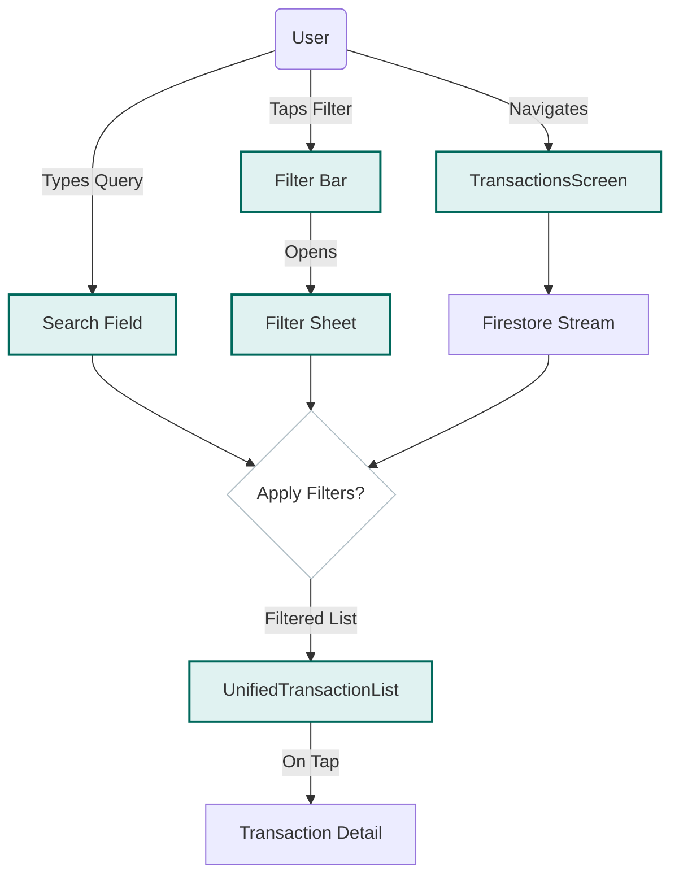

import { PropsTable } from '../../../components/props-table';

# Transactions Screen

A powerful, filter-centric view of all transactions.

## Overview

Unlike the [Expenses Screen](./expenses-screen.mdx) which focuses on charts and summaries, `TransactionsScreen` is built for power users. It offers robust filtering, saved views, and bulk operations. It adapts to wider screens with a rail layout.

## Features

- **Advanced Filtering**: Powered by `TransactionFilter` and `TransactionFilterBar`. Filters by type, date, amount, category, etc.
- **Saved Views**: Uses `SavedViewsStore` to persist custom filter configurations (e.g., "High Value Food").
- **Bulk Operations**: Multi-select mode allows deleting or relabeling multiple transactions at once.
- **Responsive Layout**: Switches to a Row-based layout on screens wider than 600px, placing filters on the left rail.

## Architecture

**Search & Filter Flow:**

- **State**: Manages `_filteredExpenses` and `_filteredIncomes` based on the active `TransactionFilter`.
- **Widgets**:
    - `TransactionFilterBar`: The control panel for applying filters.
    - `UnifiedTransactionList`: The shared list component that renders the actual items.
    - `AnimatedMintBackground`: Provides the visual ambiance.

## Props

<PropsTable props={[
  {
    name: 'userPhone',
    type: 'String',
    required: true,
    description: 'User identifier for data streams.'
  }
]} />
