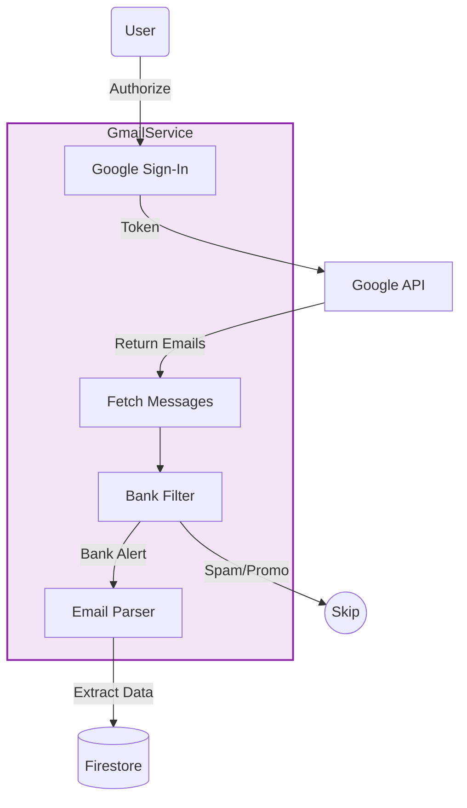

import { PropsTable } from '../../../components/props-table';

# Gmail Service

Cloud-based transaction synchronization.

## Overview

`GmailService` connects to the user's Gmail account via OAuth to fetch, parse, and ingest financial transaction emails (e.g., statements, alerts). It acts as a backup and complement to SMS ingestion, especially for reliable bill tracking.

## OAuth & Ingestion Flow

## Logic Deep Dive

1.  **Auth**: Uses `google_sign_in` with `gmail.readonly` scope.
2.  **Query**: Fetches messages matching specific queries (e.g., `subject:transaction`, `from:bank`).
3.  **Bank Detection**: `_detectBank` identifies the sender (e.g., HDFC, SBI) based on domain headers.
4.  **Parsing**: Specific logic per bank tier (Major vs Generic) to extract amounts.
5.  **Reconciliation**: Checks if an SMS transaction already exists for the same amount/date to avoid duplicates.

## Features

- **Bill Detection**: Scans for "Credit Card Bill Generated" emails to populate the "Bills" tab.
- **Masking**: Automatically redacts sensitive info like full account numbers before processing.
