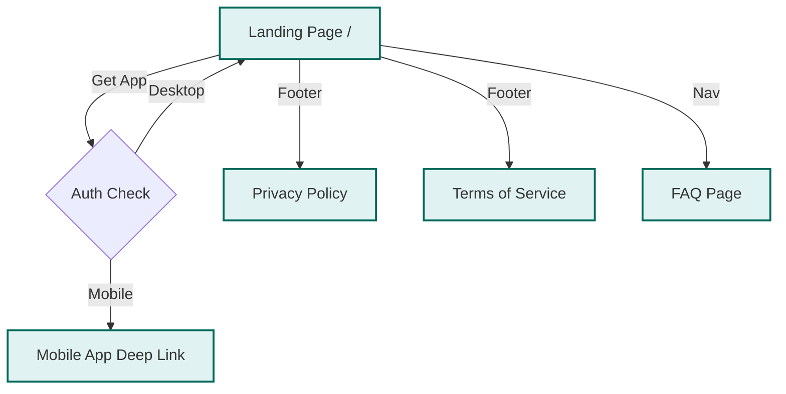

import { PropsTable } from '../../components/props-table';

# Marketing Website

The public face of Fiinny.

## Tech Stack

- **Framework**: [Next.js 14](https://nextjs.org/) (App Router)
- **Styling**: [Tailwind CSS](https://tailwindcss.com/)
- **Animations**: [Framer Motion](https://www.framer.com/motion/)
- **Hosting**: Firebase Hosting

## Project Structure

- `app/`: Application routes and page templates.
- `components/`: Reusable UI blocks (Hero, Features, Footer).
- `public/`: Static assets (images, fonts).

## Site Architecture

## Key Features

- **SEO Optimized**: Server-Side Rendering (SSR) for maximum visibility.
- **Responsive**: Mobile-first design adapting to all viewports.
- **Performance**: High Lighthouse scores for Core Web Vitals.
